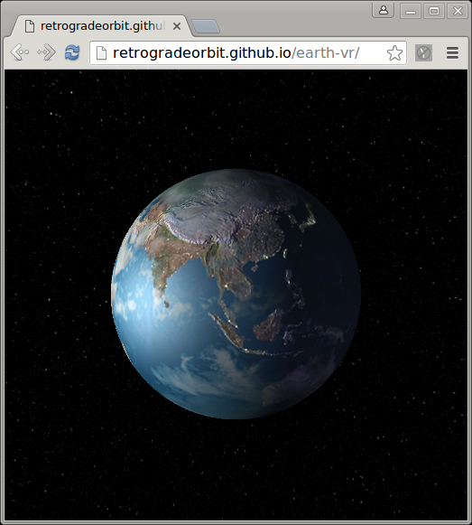

# earth-vr

A VR rendition of mother earth done in browser with clojurescript and THREE.js

## Overview

[Watch it!](https://retrogradeorbit.github.io/earth-vr/)

Textures come from [planelpixelemporium.com](http://planetpixelemporium.com/earth.html)

## Setup

To get an interactive development environment run:

    lein figwheel

and open your browser at [localhost:3449](http://localhost:3449/).
This will auto compile and send all changes to the browser without the
need to reload. After the compilation process is complete, you will
get a Browser Connected REPL. An easy way to try it is:

    (js/alert "Am I connected?")

and you should see an alert in the browser window.

To clean all compiled files:

    lein clean

To create a production build run:

    lein do clean, cljsbuild once min

And open your browser in `resources/public/index.html`. You will not
get live reloading, nor a REPL.

## TODO

Haven't yet implemented web-vr split vision and head tracking.

## License

Copyright © 2016 Crispin Wellington

Distributed under the Eclipse Public License either version 1.0 or (at your option) any later version.
